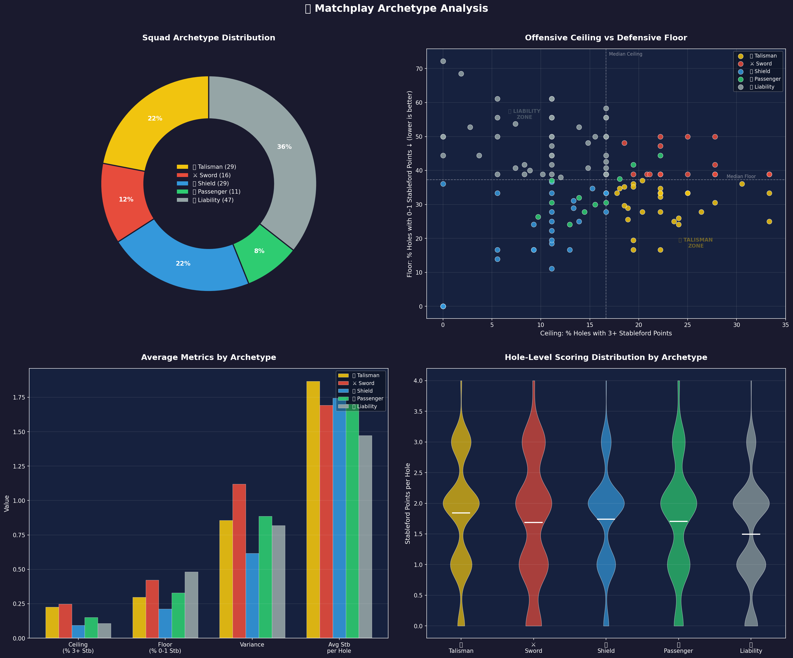
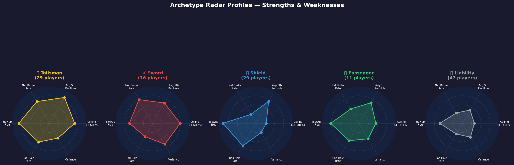

# The Sum Is Greater Than The Parts: A Data-Driven Approach to Pair Complementarity in Handicapped Golf Matchplay

**Abstract**
This paper explores a purely data-driven methodology for selecting optimal pairings in handicapped golf matchplay. By actively ignoring subjective preconceptions, historical pair performance, and practice round outcomes, the model focuses exclusively on recent hole-level statistics over the last $n$ rounds to mathematically determine pair complementarity. Grounded in the concept that "the sum of a pairing should be greater than the parts," the system leverages archetype classification and maximum weighted matching to construct team rosters that minimise compounding errors and maximise expected matchplay points.

## 1. Background
In traditional handicapped golf team competitions, prior to the start of a season, there is no historical record of how specific pairings have performed together. Captains have no empirical evidence that pairing Player A with Player B produces better matchplay outcomes than any alternative combination. In the absence of this data, pair selection typically defaults to subjective heuristics: individual strokeplay rankings, interpersonal dynamics, gut instinct about "who plays well together," or over-indexing on the fleeting outcomes of individual stableford or medal rounds. While these human factors are ubiquitous, they fail to capture the mathematical nuances of matchplay formats - such as fourballs - where the combined, hole-by-hole performance of a pair dictates the outcome.

Non-handicap (scratch) matchplay is fundamentally about the exchange of pressure. Players assert dominance by switching pressure at critical points in the match to force mistakes from their opposition; success is as much about suffocating opponents into making errors as it is about making exceptional individual plays. However, in handicapped amateur golf, the reality is that *everyone* is going to make mistakes. Therefore, rather than striving for perfection, the strategic imperative shifts to minimising the significance of those inevitable errors by selecting a pair whose scoring patterns complement each other.

This project introduces a systemic pipeline to optimise team configurations, specifically targeting a 10-man team (5 pairs). Crucially, this is a purely data-driven exercise evaluated strictly on the last $n$ recorded rounds, stripping away subjective captaincy and focusing solely on recent empirical hole-level performance. By shifting the focus away from standalone individual excellence, the system seeks to prove its core thesis: the sum of a pairing should be strictly greater than its individual parts.

It must be acknowledged, however, that no statistical model can replace the single most important factor in pair selection: **interpersonal compatibility**. Two players must be able to share the same physical and emotional space for four hours under competitive pressure. Mindset, temperament, and mutual trust are paramount - a statistically "perfect" pairing is worthless if the players cannot coexist on the course. The model presented here operates on the explicit assumption that all candidate pairings have already passed this fundamental human filter. It does not attempt to quantify chemistry; rather, it optimises *within* the set of pairings that a captain has already deemed personally compatible.

## 2. The Concept: Archetypes and Synergy
The core concept driving this model is the categorisation of players into defined tactical archetypes based on granular hole-by-hole statistics, completely bypassing total gross or net scores. Rather than asking "who shoots the best rounds?", the model asks "what does a player's scoring *distribution* look like on a hole-by-hole basis, and how does that distribution interact with a partner's?"

Each player is classified into one of five archetypes, determined by their position relative to the squad's median values for ceiling (percentage of 3+ stableford holes), floor (percentage of 0-1 stableford holes), and scoring variance:

### 2.1 The Sword ⚔️
**Profile:** High ceiling, low floor, high variance.

The Sword is the archetypal matchplay weapon. These players produce a disproportionate number of net birdies and match-winning 3+ stableford scores, but this upside comes at a cost - they are equally capable of recording blow-up holes that contribute nothing. Their scoring distribution is wide and volatile.

In stroke play, Swords are frustrating to watch: their card is a rollercoaster of brilliance and disaster that often nets out to an unremarkable total. But matchplay is a fundamentally different game - each hole is an independent event, and the Sword's ability to produce a match-winning score on *any* given hole is a powerful offensive asset. The key insight is that a Sword's blow-up holes become irrelevant when their partner is covering them. This is why the Sword-Shield pairing is the model's gold standard: the Sword attacks freely, knowing their partner has already secured the floor.

- **Strengths:** Capable of winning holes outright. In a fourball format, their explosive upside can be leveraged without downside if their partner provides cover. They thrive when "freed up" to play aggressively.
- **Weaknesses:** Unreliable in isolation. If the Sword is your only contributor on a given hole and they misfire, the hole is conceded. Pairing two Swords together risks redundant birdies on the same hole and compounding disasters on others.

### 2.2 The Shield 🛡️
**Profile:** High floor, low ceiling, low variance.

The Shield is the antithesis of the Sword - a model of consistency. Their scoring distribution is narrow and tightly clustered around net par. They rarely produce spectacular net birdies, but they almost never have catastrophic blow-up holes either. Their card reads like a metronome: par, par, bogey, par.

In stroke play, Shields are the backbone of any team event - they grind out predictable, respectable totals. In matchplay, their value is more subtle but no less critical: they provide a guaranteed floor on virtually every hole. The psychological impact of a Shield should not be underestimated. Opponents cannot build momentum against a pair when the Shield is perpetually "in the hole" with a net par, quietly neutralising every advantage the opposition tries to establish. The Shield doesn't need to win holes - they just need to ensure that none are given away cheaply.

- **Strengths:** Provides a reliable baseline score on virtually every hole. In a fourball pair, the Shield ensures that the team is always "in the hole," maintaining steady pressure and never gifting easy wins to the opposition. Their consistency is psychologically invaluable.
- **Weaknesses:** Limited match-winning potential in isolation. Against a strong opposing pair, a Shield-only team will struggle to win holes outright. Two Shields together produce an extremely narrow band of scores that, while safe, may simply lack the firepower to overcome competent opponents.

### 2.3 The Talisman ⭐
**Profile:** High ceiling *and* high floor (low blow-up rate).

The Talisman is the single most important archetype in the model-and arguably the most important type of player in matchplay golf. They are the rarest and most premium classification: a player who combines the Sword's attacking capability with the Shield's consistency. They produce a high proportion of net birdies while simultaneously avoiding blow-up holes. Their variance is typically moderate because their scoring distribution is skewed positively rather than spread broadly.

What makes the Talisman uniquely valuable is their potential to change gear. They can defend when the match demands steadiness-grinding out net pars to hold the line-but shift up to attack when opportunity arises. Their statistical profile reflects this adaptability: a high net birdie rate combined with a low blow-up rate suggests a player who can modulate their risk-taking according to circumstance, rather than being locked into a single mode of play.

- **Strengths:** Effective in any pairing configuration. The Talisman is genuinely greater than the sum of their parts because they contribute both offence and defence simultaneously - and critically, they appear to do so *situationally*. They are the player every captain wants, and the player around whom the strongest teams are built.
- **Weaknesses:** Their scarcity is the primary limitation. Because the Talisman is defined by performing above the squad median on *both* ceiling and floor metrics, they are statistically uncommon. The model must be cautious not to "waste" a Talisman by pairing them with another premium player when that Talisman could elevate a weaker partner instead.

### 2.4 The Liability ❌
**Profile:** Low ceiling *and* low floor (high blow-up rate).

The Liability is the most challenging archetype to deploy. These players rarely produce net birdies and frequently record blow-up holes. Their scoring distribution is weighted heavily toward the negative end - 0 and 1 stableford point holes dominate.

It is important to note that "Liability" is a *statistical* classification within the context of the current squad, not a judgement on the player's ability or character. A Liability may be a fine golfer going through a rough patch, or a player whose handicap hasn't yet adjusted to recent form changes. The model is explicitly agnostic to *why* the numbers look the way they do - it simply reflects what the recent data shows. That said, the model cannot capture intangible factors such as course knowledge, composure under pressure, or leadership qualities that may make a Liability more valuable to the team than their statistics suggest. Captains should treat the Liability classification as a flag for careful deployment rather than automatic exclusion.

- **Strengths:** May possess intangible qualities (course knowledge, temperament, leadership) that the model cannot capture. Occasionally, their sheer volume of handicap strokes on difficult index holes can produce valuable net-par contributions on specific holes where low-handicap opponents receive no shots.
- **Weaknesses:** Structurally unreliable as a partner. In a fourball, the Liability places an enormous burden on their partner to carry the team. Pairing two Liabilities is catastrophic - neither can cover for the other, and the pair will routinely concede holes without contest.

### 2.5 The Passenger 🚶
**Profile:** Mid-everything - median ceiling, median floor, moderate variance.

The Passenger is the archetypal "average" player in the squad context. They are neither explosive nor steady, neither dangerous nor fragile. Their scoring distribution sits close to the squad median across all dimensions.

The Passenger's value is subtle and often underappreciated. While they lack the headline metrics of a Sword or the rock-solid reliability of a Shield, their versatility makes them a useful tactical asset. A Passenger can be paired with almost any archetype without catastrophic consequences - they won't amplify a Sword's volatility, and they won't drag down a Shield's consistency. In practice, Passengers often end up being the "glue" players that allow the optimiser to deploy the more specialised archetypes in their ideal configurations. The best Passengers are those whose median-level performance is quietly competent rather than genuinely mediocre - a fine distinction that the model captures through their average stableford per hole.

- **Strengths:** Versatile and low-risk. The Passenger can be slotted into a variety of pairings without causing significant harm. They won't lose you the match.
- **Weaknesses:** They won't win it either. The Passenger's defining characteristic is their lack of a defining characteristic. In optimisation terms, they contribute modest synergy to any pairing, meaning the algorithm will typically prefer configurations that deploy more specialised archetypes first.

### 2.6 Archetype Visualisations

The following charts illustrate how the five archetypes manifest across the squad, based on the most recent 6 rounds of competition data.

- **Top-left (Donut):** Proportion of the squad classified into each archetype. Indicates how balanced or skewed the available player pool is.
- **Top-right (Scatter):** Each player plotted by their ceiling (% of 3+ stableford holes) against their floor (% of 0-1 stableford holes). Dashed lines mark the squad median on each axis, dividing the field into the four primary archetype zones. Bottom-right is the Talisman zone; top-left is the Liability zone.
- **Bottom-left (Grouped Bar):** Average values of each key metric broken down by archetype. Visually confirms that Swords lead on ceiling, Shields lead on floor (low blow-up rate), and Talismans score well on both.
- **Bottom-right (Violin):** The full hole-level stableford distribution for all players in each archetype. Wider shapes indicate higher variance; the white line marks the mean. Swords show the widest spread, Shields the narrowest.

Each radar chart normalises six metrics to a 0-1 scale across the squad (metrics where lower is better are inverted so that "bigger = stronger" in all cases):

- **Talisman ⭐:** The most complete profile - strong across all six dimensions with no obvious weakness. The largest overall radar area of any archetype.
- **Sword ⚔️:** Dominant on ceiling and net birdie rate, but visibly weaker on blow-up frequency and bad hole rate. The classic high-risk, high-reward shape.
- **Shield 🛡️:** Near-perfect on defensive metrics (low blow-up frequency, low bad hole rate) but noticeably compressed on offensive dimensions. The inverse of the Sword.
- **Passenger 🚶:** A balanced, mid-sized polygon sitting close to the centre on all axes. No standout strength, no glaring weakness.
- **Liability ❌:** The smallest overall radar area - weak on nearly every dimension, confirming the structural challenge of deploying these players.

An interactive version of the scatter plot is available in the notebook (`archetype_scatter.html`), allowing mouseover inspection of individual players.

### 2.7 Pairing Dynamics
In a matchplay environment, pairing two Swords together risks redundant birdies on the same hole, followed by conceded holes when both misfire simultaneously. Conversely, pairing two Shields produces a safe but toothless combination that may lack the aggressive scoring firepower required to defeat strong opponents. The model's core insight is that **complementary archetypes outperform homogeneous ones**.

The optimal configuration - the Sword and Shield pairing - maximises hole coverage in fourball formats. The Shield provides a reliable baseline on every hole, enabling the Sword to adopt an aggressive strategy without exposing the team to significant downside risk.

Critically, **Talisman pairings receive a premium bonus** in the scoring model. Because a Talisman contributes both offence and defence simultaneously, pairing a Talisman with a Liability or Passenger can elevate the weaker player's effective contribution - the Talisman covers the partner's blow-up holes while still producing attacking scores. The model rewards Talisman+Liability and Talisman+Passenger pairings to reflect this unique "force multiplier" effect.

The complete pairing bonus and penalty structure used by the optimiser is summarised below:

#### Complementary Pairings (Rewarded)

| Pairing | Bonus | Rationale |
|---|---|---|
| Sword ⚔️ + Shield 🛡️ | +0.30 | The classic complementary configuration. The Shield's guaranteed floor frees the Sword to attack without consequence. Maximum hole coverage. |
| Talisman ⭐ + Liability ❌ | +0.25 | Force multiplier - the Talisman's dual-mode capability covers the Liability's structural weaknesses while still producing offensive scores. The strongest "elevation" pairing. |
| Talisman ⭐ + Passenger 🚶 | +0.20 | The Talisman elevates a mid-tier contributor, providing both the ceiling the Passenger lacks and the floor insurance they need. |
| Talisman ⭐ + Shield 🛡️ | +0.15 | An inherently solid pair - the Shield adds redundant defensive coverage while the Talisman provides the attacking dimension. Lower bonus because both are already defensively strong. |
| Talisman ⭐ + Sword ⚔️ | +0.10 | Explosive offensive potential with the Talisman providing cover during the Sword's inevitable misfires. Lower bonus than Sword+Shield because the Talisman's offensive capability partially overlaps with the Sword's. |

#### Homogeneous Pairings (Penalised)

| Pairing | Penalty | Rationale |
|---|---|---|
| Liability ❌ + Liability ❌ | −0.30 | Catastrophic. Neither player can cover for the other. The pair will routinely concede holes without contest. |
| Sword ⚔️ + Sword ⚔️ | −0.20 | Redundant birdies on good holes; compounding disasters on bad ones. Amplifies variance rather than smoothing it. |
| Talisman ⭐ + Talisman ⭐ | −0.15 | Wasteful deployment of the squad's two most premium players. Both would generate more team value paired with weaker partners they can elevate. |
| Shield 🛡️ + Shield 🛡️ | −0.10 | Safe but toothless. The pair holds ground but lacks the firepower to win holes outright against competent opposition. |

Anecdotally, the psychological momentum in amateur matchplay often hinges on these complementary dynamics - the classic "ham and egg" effect. There are few things more demoralising for an opponent than watching a high-handicap Shield secure an unlikely net-par on a difficult index hole, completely neutralising the opponent's advantage after the Sword has hit one out of bounds and effectively bailing their partner out. This overlapping coverage ensures that the team remains insulated from disaster, maintaining steady pressure on the opponents, while retaining the firepower to win holes outright.

## 3. Methodology & System Architecture
The system is built on a modular Python-based pipeline that executes the following lifecycle:

### 3.1 Data Acquisition and Parsing
Accurate hole-level statistics are critical. The pipeline ingests raw event data, systematically parsing it into structured, typed datasets (`competition_players`, `round_summary`, and `round_holes`). Robust handling of missing data and rigorous typing guarantee data integrity prior to modelling.

### 3.2 Feature Engineering
Features are engineered at the granular hole-level. The system calculates:
- Frequency distributions of hole scores relative to par (e.g., Birdie rates vs. Bogey rates).
- Scoring volatility and variance markers for individual players.
- Baseline expected values for each hole.

### 3.3. Pair Scoring Model
Using the engineered features, every possible pairing combination within the available squad is evaluated. The model computes a "Synergy Score" that quantifies the probability of the pair securing the lowest net score on any given hole. It essentially calculates the combined expected hole-by-hole output, penalising overlapping high-variance and rewarding complementary coverage.

### 3.4. Team Optimisation via Maximum Weighted Matching
Selecting one optimal pair is relatively straightforward, but selecting five non-overlapping pairs from a squad to maximise the *overall team win expectancy* is computationally complex. The pipeline models the combinations as a network graph and applies a maximum weighted matching algorithm to identify the globally optimal 10-man team structure.

## 4. Analysis
DRAFT - WORK IN PROGRESS: need a list of the available players instead of just using everyone that played the last 6 rounds.
Things to look specifically into:
- Did the simulation validate the Sword/Shield hypothesis in practice? 
- What was the mathematical increase in expected matchplay points or win probability compared to a naive ranking-based selection method?
- Were there any surprising pairings generated by the algorithm that a human captain would have missed?

## 5. Conclusion
DRAFT - WORK IN PROGRESS: This project demonstrates that subjective matchplay pairings can be effectively supplanted - or heavily augmented - by an objective, data-driven approach. By analysing hole-level volatility and intentionally pairing complementary scoring archetypes, captains can mathematically optimise their expected outcomes in handicapped matchplay competitions. 
